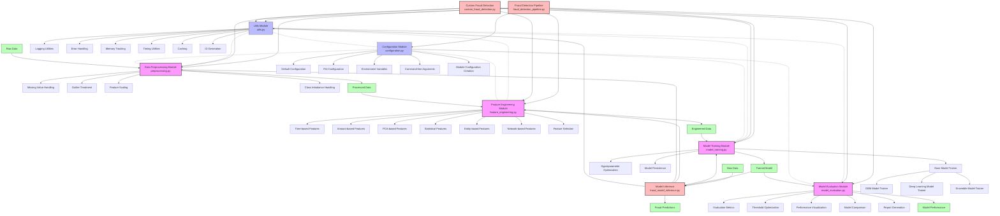

```mermaid

graph TB
    %% Main modules
    Utils[Utils Module\nutils.py]
    Config[Configuration Module\nconfiguration.py]
    Preproc[Data Preprocessing Module\npreprocessing.py]
    FeatEng[Feature Engineering Module\nfeature_engineering.py]
    ModelTrain[Model Training Module\nmodel_training.py]
    ModelEval[Model Evaluation Module\nmodel_evaluation.py]
    
    %% Pipeline modules
    Pipeline[Fraud Detection Pipeline\nfraud_detection_pipeline.py]
    CustomFraud[Custom Fraud Detection\ncustom_fraud_detection.py]
    Inference[Model Inference\nfraud_model_inference.py]
    
    %% Utils subcomponents
    Utils --> Logging[Logging Utilities]
    Utils --> ErrorHandling[Error Handling]
    Utils --> MemTrack[Memory Tracking]
    Utils --> Timing[Timing Utilities]
    Utils --> Cache[Caching]
    Utils --> IDGen[ID Generation]

    %% Configuration subcomponents
    Config --> DefaultConfig[Default Configuration]
    Config --> FileConfig[File Configuration]
    Config --> EnvConfig[Environment Variables]
    Config --> ArgConfig[Command-line Arguments]
    Config --> ModuleConfig[Module Configuration Creation]
    
    %% Preprocessing subcomponents
    Preproc --> MissingValues[Missing Value Handling]
    Preproc --> OutlierHandling[Outlier Treatment]
    Preproc --> Scaling[Feature Scaling]
    Preproc --> Sampling[Class Imbalance Handling]
    
    %% Feature Engineering subcomponents
    FeatEng --> TimeFeatures[Time-based Features]
    FeatEng --> AmountFeatures[Amount-based Features]
    FeatEng --> PCAFeatures[PCA-based Features]
    FeatEng --> StatFeatures[Statistical Features]
    FeatEng --> EntityFeatures[Entity-based Features]
    FeatEng --> NetworkFeatures[Network-based Features]
    FeatEng --> FeatSelect[Feature Selection]
    
    %% Model Training subcomponents
    ModelTrain --> BaseTrainer[Base Model Trainer]
    BaseTrainer --> GBMTrainer[GBM Model Trainer]
    BaseTrainer --> DLTrainer[Deep Learning Model Trainer]
    BaseTrainer --> EnsembleTrainer[Ensemble Model Trainer]
    ModelTrain --> HyperOpt[Hyperparameter Optimization]
    ModelTrain --> ModelPersist[Model Persistence]
    
    %% Model Evaluation subcomponents
    ModelEval --> Metrics[Evaluation Metrics]
    ModelEval --> ThresholdOpt[Threshold Optimization]
    ModelEval --> Visualization[Performance Visualization]
    ModelEval --> ModelCompare[Model Comparison]
    ModelEval --> Report[Report Generation]
    
    %% Pipeline dependencies
    Pipeline --> Config
    Pipeline --> Preproc
    Pipeline --> FeatEng
    Pipeline --> ModelTrain
    Pipeline --> ModelEval
    Pipeline --> Utils
    
    CustomFraud --> Preproc
    CustomFraud --> FeatEng
    CustomFraud --> ModelTrain
    CustomFraud --> ModelEval
    CustomFraud --> Utils
    
    Inference --> ModelTrain
    Inference --> FeatEng
    Inference --> Preproc
    Inference --> Utils
    
    %% Cross-cutting concerns
    Utils -.- Config
    Utils -.- Preproc
    Utils -.- FeatEng
    Utils -.- ModelTrain
    Utils -.- ModelEval
    
    Config -.- Preproc
    Config -.- FeatEng
    Config -.- ModelTrain
    Config -.- ModelEval
    
    %% Data Flow
    RawData[Raw Data] --> Preproc
    Preproc --> ProcessedData[Processed Data]
    ProcessedData --> FeatEng
    FeatEng --> EngineeredData[Engineered Data]
    EngineeredData --> ModelTrain
    ModelTrain --> TrainedModel[Trained Model]
    TrainedModel --> ModelEval
    ModelEval --> Performance[Model Performance]
    
    %% Inference Flow
    NewData[New Data] --> Inference
    TrainedModel --> Inference
    Inference --> Predictions[Fraud Predictions]
    
    %% Style
    classDef core fill:#f9f,stroke:#333,stroke-width:2px;
    classDef util fill:#bbf,stroke:#333,stroke-width:1px;
    classDef data fill:#bfb,stroke:#333,stroke-width:1px;
    classDef pipeline fill:#fbb,stroke:#333,stroke-width:2px;
    
    class Preproc,FeatEng,ModelTrain,ModelEval core;
    class Utils,Config util;
    class RawData,ProcessedData,EngineeredData,TrainedModel,Performance,NewData,Predictions data;
    class Pipeline,CustomFraud,Inference pipeline;

```