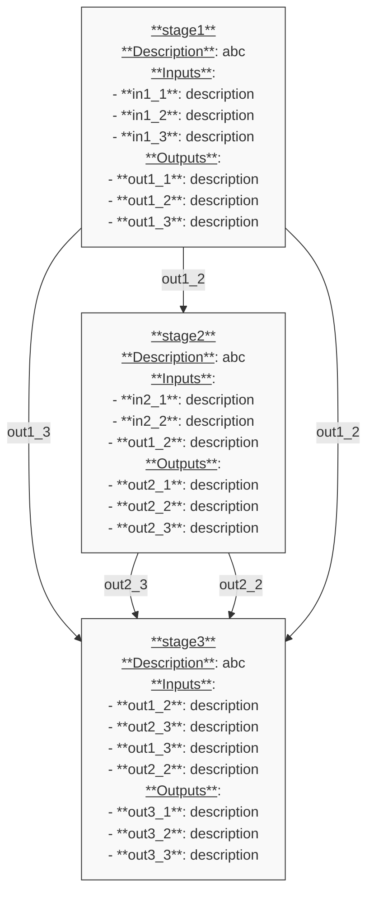

```mermaid
flowchart TB
    stage1["<ins>**stage1**</ins>
		<ins>**Description**</ins>: abc
		<ins>**Inputs**</ins>:
			- **in1_1**: description
			- **in1_2**: description
			- **in1_3**: description
		<ins>**Outputs**</ins>:
			- **out1_1**: description
			- **out1_2**: description
			- **out1_3**: description"]
    stage2["<ins>**stage2**</ins>
		<ins>**Description**</ins>: abc
		<ins>**Inputs**</ins>:
			- **in2_1**: description
			- **in2_2**: description
			- **out1_2**: description
		<ins>**Outputs**</ins>:
			- **out2_1**: description
			- **out2_2**: description
			- **out2_3**: description"]
    stage3["<ins>**stage3**</ins>
		<ins>**Description**</ins>: abc
		<ins>**Inputs**</ins>:
			- **out1_2**: description
			- **out2_3**: description
			- **out1_3**: description
			- **out2_2**: description
		<ins>**Outputs**</ins>:
			- **out3_1**: description
			- **out3_2**: description
			- **out3_3**: description"]
    stage1 -->|"out1_3"| stage3
    stage1 -->|"out1_2"| stage2
    stage2 -->|"out2_3"| stage3
    stage1 -->|"out1_2"| stage3
    stage2 -->|"out2_2"| stage3
classDef default fill:#f9f9f9,stroke:#333,stroke-width:1px
```